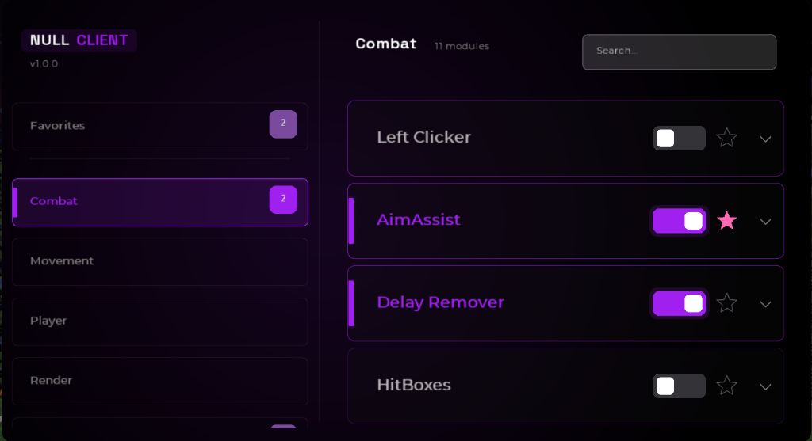
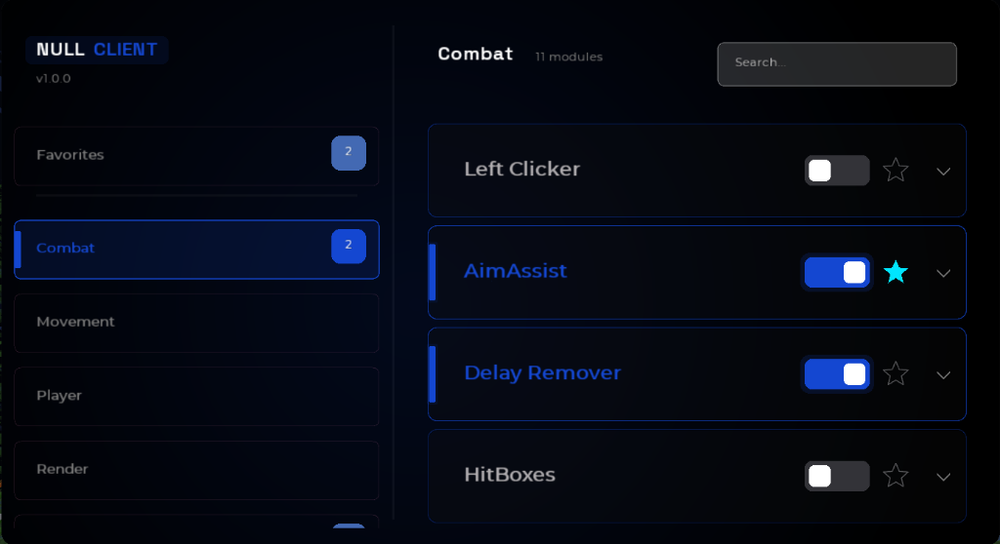
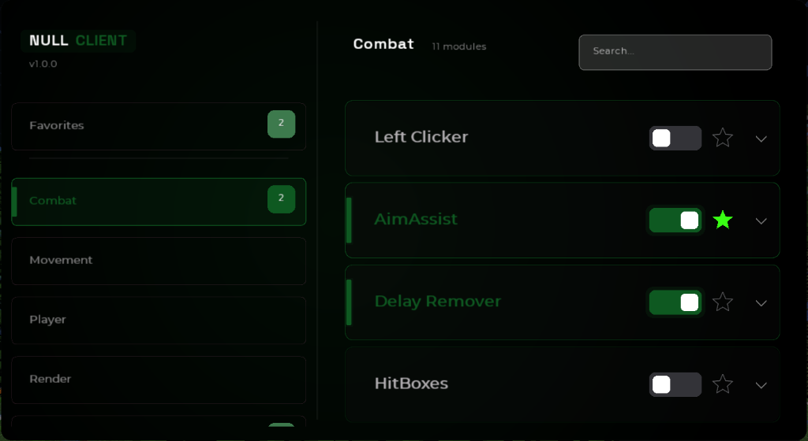
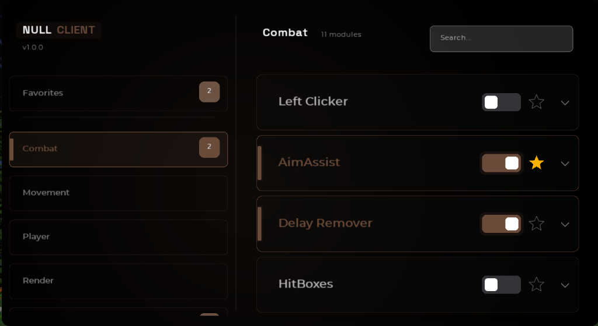

# NULL Client



NULL is a premium, high-performance utility client for Minecraft 1.8.9, designed with a focus on a sleek "Obsidian Terminal" aesthetic and unparalleled user experience.

## ✨ What Makes Us Special

Unlike traditional clients, NULL focuses on a **minimalist yet powerful interface** that feels like a modern developer tool rather than a cluttered gaming overlay.

- **Obsidian Terminal UI**: A custom-built, glassmorphic interface with smooth animations and high-fidelity typography.
- **Dynamic Theme System**: Switch between 4 professionally curated color palettes in real-time without restarting.
- **Ultra-Fast Global Search**: Instant module discovery with a pre-indexed search engine.
- **Advanced Profile Management**: Seamlessly create, rename, and switch between complex configurations.
- **Performance Optimized**: Built from the ground up to ensure maximum FPS and zero input lag.

## 🎨 Themes

Experience NULL in your favorite style. Our dynamic theme system updates every single UI element, from toggles to glow effects.

| Amethyst (Default) | Ocean |
| :---: | :---: |
|  |  |
| **Emerald** | **Amber** |
|  |  |

## 🚀 Key Features

- **Global Search**: Press `/` or click the search bar to instantly filter modules across all categories.
- **Favorites System**: Star your most-used modules for quick access in the dedicated "Favorites" tab.
- **Modular Design**: Every component is built for clarity and ease of use.
- **Custom Fonts**: Choose from high-quality typefaces like Inter, Roboto, and Montserrat.

---

## 🛠️ How to build it yourself

1. [Get](https://gradle.org/next-steps/?version=2.7&format=bin) and [install](https://docs.gradle.org/current/userguide/installation.html) gradle.
2. Download and clone this repository.
3. Open a terminal in the project directory and run:
   ```bash
   ./gradlew build
   ```
4. Find your built JAR in `build/libs/`.
